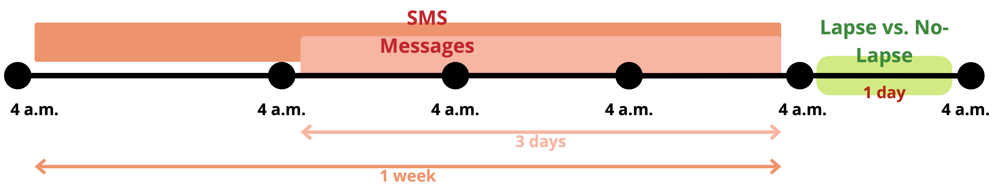

```{r}
#| include: false
options(conflicts.policy = "depends.ok")

library(tidyverse)
library(lubridate)
# library(janitor, include.only = c("tabyl", "clean_names"))
library(here, include.only = c("here"))
library(yardstick, exclude = "spec")

theme_set(theme_classic())

devtools::source_url("https://github.com/jjcurtin/lab_support/blob/main/format_path.R?raw=true")
# devtools::source_url("https://github.com/jjcurtin/lab_support/blob/main/fun_eda.R?raw=true")

path_shared <- format_path(str_c("studydata/risk/data_processed/shared"))
path_messages <- format_path(str_c("studydata/risk/data_processed/messages"))
path_models <- format_path(str_c("studydata/risk/models/messages"))
```

# Specific Aims

## Background

According to National Survey on Drug Use and Health (NSDUH), 29.5 million people age 12 and older had alcohol use disorder (AUD) in the past year. However, only 2.2 million (less than 10%) in this age group received alcohol treatment [@nationalinstituteonalcoholabuseandalcoholismAlcoholTreatmentUnited2023; @nationalinstituteonalcoholabuseandalcoholismAlcoholUseDisorder2023]. Provider availability in rural areas, fear of stigma, and economic hardship all contribute to racial, gender and age disparities in treatment seeking [@abrahamAvailabilityMedicationsTreatment2020; @dibartoloAlcoholUseDisorder2017; @youngDifferencesPerceptionsPractices2018; @kaufmannTreatmentSeekingBarriers2014; @schulerPerceivedBarriersTreatment2015; @verissimoInfluenceGenderRace2017]. The emergence of digital therapeutics (DTx) has provided new opportunities to address such health disparity in underprivileged groups with its higher accessibility, acceptability and at least modest efficacy [@beukenhorstUsingSmartphonesReduce2022a; @jacobsonUsingDigitalTherapeutics2023; @mckayEfficacyComparativeEffectiveness2022a; @perskiAcceptabilityDigitalHealth2021]. The broad goal of this program of research is to improve the effectiveness of DTx, by adding personal sensing capabilities and algorithms that allow DTx to have more refined capacities in anticipating lapses and personalizing interventions and supports to meet individuals' momentary needs [@baeMobilePhoneSensors2018a; @leeDataDrivenDigitalTherapeutics2023; @carreiroMHealthDetectionIntervention2018a].
<!-- We have started to move away from this framing of DTx as treatment and use improving those treatments by making them smart.   I no longer think they are best considered Tx, maybe ok to talk about them as providing continuing care though. I think what we are building can be separated from DTx.  It is a monitoring and support system (though I dont really like the "support" term. Still looking for a better name!-->

Machine learning models leveraging ecological momentary assessment (EMA) measures have performed relatively well to predict goal-inconsistent alcohol use (e.g., lapses), yet this methodology is associated with several limitations. As it actively relies on self-reports, it places some measurement burden on users. This is particularly problematic as AUD is a chronic disease that requires constant risk monitoring. Reducing sampling rates and number of survey items might reduce this burden but at the cost of impairing prediction precision and temporal specificity. Further, selection of EMA items is based on a top-down, theory-driven approach that may be limited by historical biases in the research literature (e.g., over-representation of white, males). Given this, we might miss important constructs that predict lapses among individuals from groups that have been less well-studied.
<!-- last paragraph was good! Though maybe you need a better transition from the first paragraph.  You talk about algorithms in the first paragraph but then pivot to machine learning without connecting to two.-->

Passive sensing using text message monitoring provides an opportunity to address the above issues while still retaining some benefits of EMA. As text sensing is both passive and continuous, it simultaneously lowers measurement burden while maintaining a high sampling frequency. Research has found that users report more willingness to use passive sensing measures (vs. active) for as long as one year [@wyantAcceptabilityPersonalSensing2023a]. Some feature engineering techniques allow researchers to mine underlying constructs of texts. They are unconstrained and are thus less susceptible to knowledge gaps. They are also less biased towards previous research samples (i.e., White males). In the meantime, passive sensing methods can still attain some benefits of EMA measures. EMA measures encompass robust predictors that are supported by decades of research. Some feature engineering methods in text analysis can still seize benefits of this theory-driven approach by feeding algorithms with well-established risk factors. For example, sentiment analysis can reveal emotional tones, resembling subjective feelings measures in EMA.

Machine learning algorithms that use features from text messaging as inputs can be informative of both *who* may lapse and *why* that lapse may occur. Language analysis can identify heavy drinkers and risky drinking behaviors. Indeed, natural language processing (NLP) techniques on electronic health records and clinical notes have demonstrated moderate performance in predicting alcohol misuse, risky alcohol use and alcohol use status [@afsharNaturalLanguageProcessing2019; @vydiswaranAutomateddetectionRiskyAlcohol2024; @toValidationAlcoholMisuse2020; @topazExtractingAlcoholSubstance2019; @alzoubiAutomatedSystemIdentifying2018]. Some NLP methods can also potentially derive interpretable features that might optimize DTx design to customize recommended treatment at the moment. For example, LIWC (see *Section Customized Dictionary*) might deepen our understanding of psycholinguistic risk factors [@tausczikPsychologicalMeaningWords2010a]. Sentimental analysis weighing emotional tone might have implications for emotion-focused therapy.

## Current Study

In the current study, we ran participants text messages over a period of three months feature engineering techniques through the LIWC program. We used generated features as inputs to models that predict alcohol lapses. We evaluated both model performance and interpretability of each distinct method. Followings are the more specific aims:

**Aim 1: Train and evaluate performance of machine learning models using language features derived from LIWC to predict alcohol lapses.** We used LIWC to engineer features from raw SMS messages. For each distinct feature set derived from a variety of configurations, we trained machine learning models a contemporary statistical algorithms (XGBoost). We evaluated and statistically compared the model performance, quantified as area under the receiver operating characteristic curve (auROC).

**Aim 2: Identify important features and evaluate their interpretability with respect to recommending interventions.** Model interpretation is key to providing treatment recommendations and uncovering potential causes of lapses. We used contemporary approaches to quantify feature importance (e.g., SHAP) of features within each of the NLP techniques used.

**Aim 3: Examine model fairness in historically underprivileged subgroup populations.** It is also important to note that if embedded algorithms perform relatively worse for marginalized groups, their use can exacerbate rather than alleviate treatment disparities. As such, model performance between privileged vs. unprivileged groups should be carefully examined. We evaluated model performance in demographic subgroups that face excessive barriers accessing alcohol treatments or medications, including females, racial minorities, individuals living under poverty, and older population. 

\newpage

# Significance

AUD remains a prevalent, lasting and costly problem in the United States over the past few years. According to 2022 NSDUH [@nationalinstituteonalcoholabuseandalcoholismAlcoholTreatmentUnited2023; @nationalinstituteonalcoholabuseandalcoholismAlcoholUseDisorder2023], an estimate of 29.5 million (10.5% of the population) individuals aged 12 or older had AUD in 2022, which is consistent with the estimates for 2021. AUD problems have also brought huge economic burdens to the U.S., where excessive alcohol use has cost \$223.5 billion in 2006 and \$249 billion in 2010 [@sacks2010NationalState2015a].

Despite the high prevalence of AUD, limited number of individuals receive alcohol treatments. Only a small portion (7.6%) of individuals aged 12 or older with AUD acquired alcohol use treatment in the past year [@nationalinstituteonalcoholabuseandalcoholismAlcoholTreatmentUnited2023; @nationalinstituteonalcoholabuseandalcoholismAlcoholUseDisorder2023]. This low treatment acquisition rate is even more pronounced for individuals from disadvantaged groups. Disparities in treatment-seeking behavior based on race, gender, and age are evident [@abrahamAvailabilityMedicationsTreatment2020; @dibartoloAlcoholUseDisorder2017; @youngDifferencesPerceptionsPractices2018; @kaufmannTreatmentSeekingBarriers2014; @schulerPerceivedBarriersTreatment2015; @verissimoInfluenceGenderRace2017]. Only 6.6% of Black or African-American people, 3.8% of people of two or more races, and 4.8% of Hispanic or Latino people with past-year AUD received treatments [@nationalinstituteonalcoholabuseandalcoholismAlcoholTreatmentUnited2023; @nationalinstituteonalcoholabuseandalcoholismAlcoholUseDisorder2023]. Women are less likely to obtain treatments compared to men, even if they have equivalent level of perceived need for help [@gilbertGenderDifferencesUse2019b].

Several obstacles hinder people's utilization of treatment options. Previous studies have identified that AUD patients face financial barriers [@kaufmannTreatmentSeekingBarriers2014; @schulerPerceivedBarriersTreatment2015], lack of knowledge or awareness [@williamsBarriersFacilitatorsAlcohol2018; @probstAlcoholUseDisorder2015; @mayBarriersTreatmentAlcohol2019], social stigma [@sedarousCultureStigmaInequities2023; @finnPerceivedBarriersSeeking2023; @wallhedfinnAlcoholConsumptionDependence2014; @mayBarriersTreatmentAlcohol2019], and geographical barriers [@gregoryFirstlineMedicationsOutpatient2022] for accessing care. Individuals with disadvantaged demographic background suffer from even heightened barriers to treatment resources. Women with high severity of alcohol use face larger fear of stigma compared to their male counterparts [@finnPerceivedBarriersSeeking2023].

## DTx and smart DTx

DTx is an emerging tool that may partially address extant challenges AUD patients face for treatment and continuing care. DTx are evidence-based health software that deliver assessments, interventions, and other supports to patients to prevent, treat, or manage a disease or disorder. Available evidence suggests they are generally effective for mental health conditions including AUD and demonstrate clear clinical advantages [@philippeDigitalHealthInterventions2022; @lecomteMobileAppsMental2020; @gustafsonSmartphoneApplicationSupport2014b]. Further, DTx may provide better access for hard-to-reach populations, including those from socially marginalized group who encounter increased barriers to access treatment. They can benefit patients from rural areas with low provider availability as they are accessible remotely via mobile phones [@bucciTheyAreNot2019; @jacobsonUsingDigitalTherapeutics2023]. DTx also have potentials to relieve barriers to seek professional help resulting from stigma concerns as they can facilitate anonymity and shorten the need for in-person interactions. They are of lower costs compared to in person care and have the capacity to be scalable.

The concept of "smart" DTx is emerging in recent years allowing us to expand the benefits of DTx. Smart DTx comprises two key components. First, they rely on personal sensing methods to collect data. Ideally, sensing should be 1) feasible and place low burden on users; 2) longitudinal; and 3) with high temporal granularity. Exemplary measures include EMA, which actively prompts users to complete surveys and can encompass desired questions on moods, social relationships, stressful events, etc. More passive sensing approaches include the measurement of geolocation, phone call logs and text messages collection. GPS tracking, phone logs sharing and SMS message sharing continuously and passively gather information. Combined with self-reports, smart DTx are capable of acquiring contextual information such as levels of support user can obtain from their frequently visited places and frequently contacted people.

Second, the rich dataset extracted from personal sensing can be incorporated into machine learning algorithms. The goal of such models is to identify *who* are at heightened risk for alcohol lapses, *when* they will lapse, and *why* they are at increased risk. Through the embedded algorithms, smart DTx can achieve two tasks: 1) continuous AUD relapse risk-monitoring; and 2) individualized, just-in-time treatment recommendations when needed. Notably, these functions are very important given the dynamic nature of alcohol relapse. AUD is a chronic, dynamic and temporally varying disease where patients face constant challenges of relapsing after abstinence [@scottPathwaysRelapseTreatment2005; @anderssonRelapseInpatientSubstance2019; @witkiewitzModelingComplexityPosttreatment2007a].

To develop such algorithms, we must first identify a clinically relevant outcome to predict. This outcome should be clearly and precisely defined across individuals, easy to measure, and with high temporal precision. Relapse, which usually refers to the return of a symptomatic behavior, is hard to quantify due to its multidimensional nature and temporal coarseness [@millerWhatRelapseFifty1996]. One potential conceptualization of alcohol relapse is linked to problems of use. Nonetheless, negative consequences are multifaceted and can therefore be burdensome to collect. It is also unclear what the onset of problems are. Another possible outcome is quantity of alcohol use. However, this measure is not temporally precise because there will be a time lag between onset of drinking and the last drink completed. Levels of drinking might also mean differently for individuals with different AUD severity, which makes it hardly generalizable across individuals. Alternatively, in this study, we utilize lapse (i.e., a single episode of alcohol use) as our primary outcome variable. Lapses are easy to define, have a clear onset, and are also clinically meaningful. They can serve as an early warning sign of failure to sustain a desired behavioral change [@chungRelapseAlcoholOther2006a; @marlattRelapsePreventionMaintenance2005a]. Research has also shown that initial lapse and frequent lapses are the associated with enhanced risk of relapse [@witkiewitzRelapsePreventionAlcohol2004b; @hogstrombrandtPredictionSingleEpisodes1999a].

Next we need to determine what inputs to use for our prediction model. The features should be easy to measure and feasible. The widespread availability of smartphones has rendered constant data collection with DTx attainable. Data collection procedure should not be unduly burdensome to users to ensure that sensing is sustainable. Previous research has established satisfying acceptability of active self-report measures such as EMA and even more willingness to use passive sensing measures [@wyantMachineLearningModels2024]. The features should also be well-validated. For example, GPS tracking has high accuracy in locating individuals and is temporally precise. Text sensing captures precisely the interactions between users and other individuals via SMS.

Desirable features should meaningfully predict lapse risks. More specifically, they should be capable of detecting increased lapse risks in a timely manner. These predictions allow windows for subsequent just-in-time intervention to prevent lapses targeting a specific person. Notably, in the current work, we will emphasize on estimating probabilities of lapsing instead of precise anticipation of lapse occurrence. Under this approach, we can avoid finding a threshold to yield class labels (lapse vs. no lapses).

We might derive top-performing features from a theory-driven approach. A theory-driven approach involves integrating domain-specific knowledge of known risks for alcohol lapses from a relapse prevention model into the algorithms. Such features are pre-specified and might involve affect state, social interactions, and alcohol-related factors. For instance, the majority of an inpatient teen sample reported initial relapse to alcohol when offered alcohol, when in negative state, and when in interpersonal conflicts [@brownCharacteristicsRelapseFollowing1989]. Other commonly found risk factors include alcohol craving [@mckayStudiesFactorsRelapse1999a; @korlakuntaReasonsRelapsePatients2012], negative affect state [@mckayStudiesFactorsRelapse1999a], cognitive factors [@mckayStudiesFactorsRelapse1999a], and interpersonal problem [@mckayStudiesFactorsRelapse1999a].

Features should also have temporal granularity given the dynamic nature of alcohol relapse risks. Smart DTx algorithms with good temporal precision should consistently collect data on situated, risk-relevant predictors while retaining low burden on users. Exemplary features with good temporal precision might involve the proximal factors depicted in the relapse prevention model [@witkiewitzModelingComplexityPosttreatment2007a; @mckayConceptualMethodologicalAnalytical2006b; @feingoldProximalVsDistal2015]. Proximal factors (e.g., drinking partner, drinking behavior) are situated and can be fluctuating over time. They usually occurs before an episode of alcohol use [@chihPredictiveModelingAddiction2014a]. They can be elusive to therapists' attention due to infrequent visits, highlighting importance of sustained monitoring to prevent lapses.

Smart DTx algorithms should also incorporate features that are interpretable and can map on to current interventions. Exemplary features that are highly interpretable include those derived from the theory-driven approach. These features are easy to interpret and closely align with established therapies. For example, features related to social relationship might have important implications for family or marital counseling. Affect state features might be informative of emotion-focused therapy. In addition to selecting interpretable features during data training, computational methods can also be used to enhance model interpretability by analyzing feature importance. For instance, we can examine global feature importance to determine which features contribute the most to predict lapses across individuals. Further, examining local feature importance (i.e., features influencing a single observation) in these models might also be helpful for model interpretation. They have benefits of identifying the factors that contribute to lapse risk for any specific person and moment in time.

Importantly, the selected features should also predict well among individuals from disadvantaged groups. One of the key benefits of DTx is that they partially address barriers utilizing professional help by providing 24/7/365, affordable, personalized support. They are particularly beneficial to marginalized groups who have low rates of utilizing treatment options due to these treatment barriers. However, they might exacerbate health inequity if embedded algorithms perform relatively worse for less privileged groups. One possible explanation of differential performance across subgroups might stem from the features we feed the algorithms. For example, features derived from a theory-driven approach might be biased towards advantaged groups because they depend on decades of research on White males. The biased features therefore might favor better prediction performance for advantaged groups because they are more robust in predicting their relapse risks. Notably, the differential performance between different groups might also be owing to the under-representation of unprivileged groups in the dataset besides feature selection. The algorithms might sacrifice some prediction accuracy for the minority groups if they are severely underrepresented in the data to ensure overall model performance. As such, it is important to recruit a diverse sample to complete model training. Some statistical resampling strategy might also be used to increase the representation of marginalized groups in the dataset.

## Recent progress in smart DTx

Recent DTx work has yielded satisfactory performance in predicting lapses with EMA measures. Our group developed an XGBoost machine learning model using self-reported craving, affect, efficacy, risky situations, stressful events, pleasant events to predict alcohol lapses in the next hour, day, or week [@wyantMachineLearningModels2024]. The surveys were collected up to four times daily for three months. The model achieved exceptional performance when predicting lapses for new individuals, with a mean auROC score of .89, .90 and .93 for the hour-, day-, and week-level model respectively. Global feature importance demonstrated that past alcohol use and future self-efficacy consistently contributed greatly across all models to predict lapses.

Nonetheless, relying on EMA measures for model building is associated with several limitations. First, constantly completing surveys makes it burdensome for real-world DTx use. Although most EMA relevant mental health research demonstrated modest compliance rates, their time windows last from two weeks to three months [@porras-segoviaSmartphonebasedEcologicalMomentary2020; @czyzEcologicalAssessmentDaily2018; @vangenugtenExperiencedBurdenAdherence2020a; @mackesy-amitiFeasibilityEcologicalMomentary2018; @hungSmartphonebasedEcologicalMomentary2016]. The study length is insufficient for real-world DTx use. As extended period of time of app use is anticipated, users' perceived burden of answering surveys is presumably larger [@mogkImplementationWorkflowStrategies2023]. Although minimizing the number of items in the surveys and the frequency of prompting users to complete the surveys might help mitigate the associated burden, it can inevitably reduce the prediction precision and temporal precision of algorithms.

Second, decisions regarding what constructs to assess and what items to include to assess these constructs are limited by theory and past data. Including risk factors solely drawn from decades of research on White, male-dominant samples might even exacerbate health disparities when applied to DTx. Further, our current understanding of alcohol relapse precursors is not comprehensive, especially for proximal factors. For example, Marlatt's proposed taxonomy characterizes high-risk situational precursors to alcohol relapse such as social pressure and positive/negative emotional state [@marlattTaxonomyHighriskSituations1996a]. Nonetheless, replication studies have found this theoretical framework to be somewhat unreliable and have low predictive validity of post-treatment outcomes [@lowmanReplicationExtensionMarlatt1996a; @stoutPredictiveValidityMarlatt1996; @kaddenMarlattRelapseTaxonomy1996]. A review study also suggests that current proximal factors are not well-understood in past research due to methodological constraints and a death of "near real-time" data [@mckayConceptualMethodologicalAnalytical2006b].

## Incorporating SMS in smart DTx

Text sensing technology, which is both feasible and sustainable, represents new opportunities in DTx that might address limitations of the current active reporting approach. Since AUD is a chronic condition requiring ongoing risk monitoring over an extended period, DTx can benefit from SMS sensing because it places a low burden on users and allows for continuous data collecti138on. Studies collecting passive data have demonstrated high acceptability from participants and higher compliance rates compared to active measures [@wyantAcceptabilityPersonalSensing2023a; @beukenhorstUsingSmartphonesReduce2022a]. Further, risk monitoring using SMS sensing is temporally sensitive to fluctuating risks. Analyzing text messages can detect potential triggers in time without actively prompting users to reflect on their feelings at the moment or report their environment.

With the burgeoning of NLP techniques, language analysis is well-equipped with diverse feature engineering tools to have good predictability with temporal specificity for alcohol lapses in new individuals. LIWC might have good performance because they allow researchers to mine previously established robust construct of alcohol lapse precursors. For example, LIWC has categories that are associated with affect and social process which are indicative of alcohol-related outcomes.

NLP also offers avenues for model interpretation to yield valuable insights into treatment recommendations. LIWC can generate features that are highly interpretable and some might even relate to extant interventions. Assessing their feature importance helps us understand how features contribute to the models (i.e., which features are robust in predicting lapses). For example, global feature importance can identify robust predictors across individuals in predicting lapses. Local feature importance provides insights on what contributes to a lapse for a specific person at a specific time. They can be useful in personalized, just-in-time treatment recommendations.

## Current Study

In this study, we utilized LIWC to predict lapses from SMS message content. More specifically, we compared different configurations varying in prediction window length and unit of analysis. We evaluated model performance from three aspects: 1) overall model prediction performance in detecting lapses; 2) model interpretability; and 3) performance between advantaged groups vs. disadvantaged groups with regards to race, gender, income and age.

\newpage

# Approach

## Overview

This study will analyze data collected from 2017-2019 from a larger grant funded by National Institute of Alcohol Abuse and Alcoholism (R01 AA024391). In this proposal, we focus on methods and measures that are relevant to this study. Additional details on broader methods and the full set of measures collected are discribed elsewhere (see https://osf.io/w5h9y/ and [@wyantMachineLearningModels2024; @wyantAcceptabilityPersonalSensing2023a]).

## Participants

Individuals in early recovery from AUD were recruited from Madison and surrounding area via social media platforms (e.g., Facebook), referrals from clinics, and television and radio advertisements. After initial phone screen, interested individuals came in-person to complete a more in-depth screening to determine their eligibility. We documented their demographic information. Inclusion criteria include that participants: 1) must be at least aged 18 or older; 2) must meet criteria for AUD with at least moderate severity (\>four DSM-5 criteria); 3) must be abstinent from alcohol for at least one week and fewer than two months at time of intake; 4) must be able to read and write in English; 5) must be willing to use smartphone and their smartphone is compatible with our study technology. Participants were excluded if they have a lifetime history of severe and persistent mental illness. One hundred sixty-nine participants were eligible and enrolled in the study. After excluding participants who discontinued before the first follow-up session and those with low compliance rates and too few messages (\<100 messages), we have a final sample size of 138 participants.

## Procedures

The study lasted up to three months with five in-person visits (see @fig-simp). Participants completed an in-person screening visit to determine their eligibility, obtain their informed consent, and collect their demographic information and self-report measures. They then completed an intake session one week later and three follow-up visits afterwards spaced at one-month intervals. During each of the follow-up visits, a research assistant downloaded participants' SMS messages from their phone, verified reports of lapses and queried participants about any additional unreported laspes. Additional self-reported measures were obtained (see https://osf.io/w5h9y/).

Throughout the course of the study, participants were expected to complete four daily EMAs that asked about their alcohol cravings, risky situations, stressful/pleasant events, etc [@wyantMachineLearningModels2024]. Notably, in the first item in the EMA survey, participants also reported their past alcohol use. Answer to this item will be used as the predicted outcome (see *Section Alcohol Lapses*).

::: {#fig-simp}
```{dot}

digraph {

  graph [layout = dot, rankdir = LR, size="6.5,0.5"];
  node [shape = rectangle];
  
  a[label = "Screening"]
  b[label = "Intake"]
  c [label = "Follow-up 1"]
  d [label = "Follow-up 2"]
  e [label = "Follow-up 3"]
  
  a -> b [label = "1 week", minlen = 1] 
  b -> c [label = "1 month", minlen = 3]
  c -> d [label = "1 month", minlen = 3]
  d -> e [label = "1 month", minlen = 3]

  subgraph {
      rankdir = LR
      
      f [shape = none, margin = 0, labelloc = t,
      label = "demographic information\n"]
      g [shape = none, margin = 0, labelloc = t,
      label = "frequent contact information\n frequent address information"]
      h [shape = none, margin = 0, labelloc = t,
      label = "illicit drug use"]
      i [shape = none, margin = 0, labelloc = t,
      label = "illicit drug use"]
      j [shape = none, margin = 0, labelloc = t,
      label = "self-reported acceptability and burden"]

  }
  
  a -> f [minlen = 0.1, color=none]
  b -> g [minlen = 0.1, color = none]
  c -> h [minlen = 0.1, color = none]
  d -> i [minlen = 0.1, color = none]
  e -> j [minlen = 0.1, color = none]
}

```

Flowchart of in-person visits. We obtained participant demographics and alcohol use history from the screening session. SMS messages were downloaded from participant phones at each of the follow-up visit.
:::

## Measures

### Individual Characteristics

We collected participants' individual characteristics including their demographics and their past drinking history during the screening session (see @tbl-measures).

| Log Type | Measure |
|:---|:---|
| Demographics | Age |
|  | Sex |
|  | Race |
|  | Ethnicity |
|  | Highest Education |
|  | Employment Status |
|  | Total Personal Gross Income |
|  | Marital Status |
|  | Family Member |
| Alcohol Use | Alcohol Use History |
|  | DSM-5 Checklist for AUD |
|  | Young Adult Alcohol Problems Test |
|  | WHO-The Alcohol, Smoking and Substance Involvement Screening Test |

: Participant self-reported measures {#tbl-measures}

### Alcohol Lapses

Participants were prompted up to four times daily to report their recent alcohol use. In the first item of each daily EMA survey, dates and times of any unreported past alcohol use were obtained. Reports of past alcohol use were used as a dichotomous outcome variable (Lapse vs. No Lapse). We predicted alcohol lapses in the next 24-hour window (i.e., next day lapse prediction). Every outcome window started from 4 a.m. everyday and end 24 hours later.

### SMS Messages

At each of the follow-up visits, a research assistant downloaded the participants' SMS message logs from their phone. These logs included the message type (incoming vs. outgoing), date and time sent/received, text body, contact name, whether the participants read the text or not, etc. Images and voice texts were excluded from analysis. Both group messages and one-on-one messages were obtained from participants' phones. We included only messages from/to important contacts and in group chats.

For each individual lapse window, we had predictor sets that differ in prediction window length and their analytic unit. We defined text prediction windows to be 3-day and 1-week preceding the lapse window (see @fig-window). We analyzed the two prediction windows both individually and combined (i.e., three configurations in total).

::: {#fig-window fig-cap="Prediction Window"}

:::

## Model Training

### Feature Engineering

Text messages served as the only raw source for all feature engineering. The document sets (varying based on unit of analysis) went through a generic pre-processing step that involves removal of all emojis. Our decision to remove all emojis was due to loss of emoji data in the ios devices during back up. This study used the LIWC dictionary [@pennebakerDevelopmentPsychometricProperties2015a] and computed scores by counting frequency of words that belong to each category. We did not remove any stop words. LIWC aligns with the current alcohol relapse risk factor literature in that it examines psychometric properties including cognitive state and social processes [@brownCharacteristicsRelapseFollowing1989; @mckayStudiesFactorsRelapse1999a; @mckayStudiesFactorsRelapse1999a].

We adopted two configurations for analytic units -- individual messages and concatenated messages. In the first configuration method, we ran individual messages within the defined prediction window through LIWC. We then normalized LIWC feature scores based on the square root of word counts instead of raw word counts which was the default choice from the program. We applied the normalization on all LIWC categories other than word count, word per sentence, and the four summary measures -- analytic, clout, authenticity, and tone. We excluded the four summary categories because their raw scores were not normalized on raw word counts. Our normalization method was chosen due to the relatively short message length for individual messages. We further obtained the median and 95% percentile of normalized LIWC scores for all messages related to each lapse label.

In the other analytic unit configuration, we first concatenated all messages associated with each lapse label altogether. We then obtained LIWC results for the concatenated messages. We further adopted three configurations for normalization methods -- normalized on raw word count (i.e., default method from the program), normalized on the square root of word count, and a combination of these two.

### Candidate Algorithm

We leveraged the XGBoost algorithm that differed on the above three configurations: 1) prediction window length (see *Section SMS Messages*); 2) analytic units (see *Section Feature Engineering*); and 3) normalization methods (see *Section Feature Engineering*). As we have a fairly imbalanced class labels in our dataset (see *Section Sample Distribution*), we further considered different resampling strategies including upsampling and downsampling with different ratios. Our decision to use the XGBoost algorithm was based on its two benefits. First, the algorithm has demonstrated satisfying performance in classifying lapse vs. no lapse in our lab's previous work [@wyantMachineLearningModels2024]. We can select the best model from a range of model-specific hyperparameters (mtry, tree depth, and learning rate), on top of the four above manually incorporated configurations. Second, XGBoost is well-suited to calculate Shapley values that can help us understand each feature's contributions to model output (see *Section Feature Importance*).

### Model Selection

We performed grouped, nested cross-validations to perform hyperparameter tuning and select the best model configuration. The dataset was participant-grouped so that each individual was assigned to either held-in or held-out set to avoid bias of predicting participants' lapses using their own data. The nested cross-validation method uses two nested loops to divide folds. In the inner loop, held-out folds were used as a validation set for model selection. In the outer loop, held-out folds were utilized as a test set for model evaluation. We presented validation results from the 300 sets in the inner loop.

The primary performance metric to select the best model configuration and evaluate the model performance on the test sets was auROC. auROC computes the area under the ROC curve which demonstrates the trade-off between sensitivity and specificity across all possible thresholds. Values between .70 and .80 are considered fair, values between .80 and .90 are considered good, and values above .90 are considered excellent. Across all models that differed on the above discussed configurations, the best model was selected based on the highest median auROC across all validation sets (see *Section Machine Learning Algorithm*).

## Model Evaluation 

### Performance Evaluation

We calculated the predicted probability scores for all our observations based on the best model configuration and then obtained the median auROC score across all 300 validation sets in the inner fold. We further performed a Bayesian hierarchical generalized linear model to estimate the posterior probability (i.e., the likelihood of achieving the results given out data) distributions of the auROCs. The two random intercepts in the models included the repeat and the fold within repeat. We reported the 95% CIs for our models' auROCs and determined if they included .5 (chance performance). If this CI included 0.5, we would conclude that our model performed no better than random guess.

### Algorithmic Bias

A subset of individual characteristic measures was used to evaluate model fairness on subgroups. We compared model performance among each sex, racial, age and income subgroups because the populations face increased barriers obtaining AUD treatments. Stigma among older populations and wome, and economic hardship in racial minority groups can all contribute to low treatment-seeking and alcohol treatment completion [@dibartoloAlcoholUseDisorder2017; @jacobsonRacialDisparitiesCompletion2007; @mayBarriersTreatmentAlcohol2019]. Participants younger than 55 years old were considered as a privileged group. We adopted half of median income in Madison area in 2017 as cut-off to assign participants to income groups.

We performed a Bayesian hierarchical generalized linear model that regressed the auROCs from the 300 validation sets in the inner loop as a function of group membership (privileged group vs. unprivileged group within each of above individual characteristics). We reported the 95% CI for model performance differences and examined if they included 0. If this CI did not include 0, we would conclude that our model was unfair.

### Feature Importance

We also calculated SHAP values to interpret the results. SHAP is a game theory based method to explain how each feature influences the model output [@lundbergUnifiedApproachInterpreting2017]. It assigns importance to each feature, where a positive feature importance positively affects the model output. This methodology can be applied to any machine learning algorithm and can increase model transparency and interpretability. Local Shapley values explain factors that contribute to a single observation, and global Shapley values represent feature importance across all observations. To compute global Shapley values, we averaged the absolute value of all local Shapley values. For better understanding, we aggregated Shapley values for each LIWC category, regardless of their prediction window and normalization methods.


\newpage

# Results

```{r}
#| echo: false
#| warning: false
#| include: false

# Load objects for results
labels <- read_csv(here::here(path_messages, "lapses.csv"), col_types = cols()) |> 
  mutate(day_start = as_datetime(day_start, tz = "America/Chicago"),
         day_end = as_datetime(day_end, tz = "America/Chicago"))

raw_data <- read_csv(here(path_messages, "eda", "eda_raw.csv"))
pred_3day <- read_csv(here(path_messages, "eda", "eda_3day.csv"))
pred_1week <- read_csv(here(path_messages, "eda", "eda_1week.csv"))

txt_length_by_id <- raw_data |> 
  group_by(subid) |> 
  summarize(
    mean_length = mean(text_length),
    median_length = median(text_length),
    min_length = min(text_length),
    max_length = max(text_length)
  )

stats_ind <- read_csv(here(path_messages, "eda", "eda_liwc_ind.csv"))
stats_cat <- read_csv(here(path_messages, "eda", "eda_liwc_cat.csv"))

aurocs <- read_csv(here(path_messages, "aurocs.csv"))
probs <- read_rds(here::here(path_models, 
                             str_c("inner_preds_", "v1", "_", 
                                   "nested_1_x_10_3_x_10", ".rds")))
pp <- read_rds(here(path_messages, "pp", "pp_auroc.rds"))
fairness <- read_csv("objects/subgroup_comparison.csv")
```

## Demographics

The final sample includes `r sprintf("%d", length(unique(labels$subid)))` participants. 73 (53%) participants are females, 17 (12%) are non-White minorities, 39 (28%) earned less than half of the median income in Madison in Year 2017, and 13 (9%) aged 55 or older.



## Sample Distribution

The final total number of lapse labels in the dataset is `r sprintf("%d", nrow(labels))`. `r sprintf("%.2f", sum(labels$lapse == "lapse")/nrow(labels)*100)`% of the labels are associated with a lapse episode. On average, each participant has `r sprintf("%.2f", labels |> group_by(subid) |> summarize(n = n()) |> pull(n) |> mean())` labels (sd = `r sprintf("%.2f", labels |> group_by(subid) |> summarize(n = n()) |> pull(n) |> sd())`, median = `r sprintf("%.2f", labels |> group_by(subid) |> summarize(n = n()) |> pull(n) |> median())`, range = `r sprintf("%d", labels |> group_by(subid) |> summarize(n = n()) |> pull(n) |> min())` - `r sprintf("%d", labels |> group_by(subid) |> summarize(n = n()) |> pull(n) |> max())`; see @fig-lapse_count).



The total number of messages in the dataset is `r sprintf("%d", nrow(raw_data))`. On average, each subject has `r sprintf("%.2f", raw_data |> group_by(subid) |> summarize(n = n()) |> pull(n) |> mean())` messages (sd = `r sprintf("%.2f", raw_data |> group_by(subid) |> summarize(n = n()) |> pull(n) |> sd())`, range = `r sprintf("%d", raw_data |> group_by(subid) |> summarize(n = n()) |> pull(n) |> min())` - `r sprintf("%d", raw_data |> group_by(subid) |> summarize(n = n()) |> pull(n) |> max())`). The average message length across all participants is `r sprintf("%.2f", raw_data |> pull(text_length) |> mean())` words (sd = `r sprintf("%.2f", raw_data |> pull(text_length) |> sd())`, median = `r sprintf("%.2f", raw_data |> pull(text_length) |> median())`, range = `r sprintf("%d", raw_data |> pull(text_length) |> min())` - `r sprintf("%d", raw_data |> pull(text_length) |> max())`). On average, each participant has a mean message length of `r sprintf("%.2f", txt_length_by_id |> pull(mean_length) |> mean())` (sd = `r sprintf("%.2f", txt_length_by_id |> pull(mean_length) |> sd())`, range = `r sprintf("%.2f", txt_length_by_id |> pull(mean_length) |> min())` - `r sprintf("%.2f", txt_length_by_id |> pull(mean_length) |> max())`).



On average, each lapse label has `r sprintf("%.2f", pred_3day |> group_by(subid, day_start) |> summarize(n = n()) |> pull(n) |> mean())` messages (sd = `r sprintf("%.2f", pred_3day |> group_by(subid, day_start) |> summarize(n = n()) |> pull(n) |> sd())`, median = `r sprintf("%.2f", pred_3day |> group_by(subid, day_start) |> summarize(n = n()) |> pull(n) |> median())`, range = `r sprintf("%d", pred_3day |> group_by(subid, day_start) |> summarize(n = n()) |> pull(n) |> min())` - `r sprintf("%d", pred_3day |> group_by(subid, day_start) |> summarize(n = n()) |> pull(n) |> max())`) during the 3-day prediction window. `r sprintf("%.2f", pred_3day |> group_by(subid, day_start) |> summarize(na = if_else(any(na), 1, 0)) |> pull(na) |> mean() * 100)`% of labels have no associated messages in the previous 3 days. Each participant has an averaged `r sprintf("%.2f", pred_3day |> group_by(subid, day_start) |> summarize(n_messages = sum(!na)) |> group_by(subid) |> summarize(mean_messages = mean(n_messages)) |> pull(mean_messages) |> mean())` messages as predictors per label (sd = `r sprintf("%.2f", pred_3day |> group_by(subid, day_start) |> summarize(n_messages = sum(!na)) |> group_by(subid) |> summarize(mean_messages = mean(n_messages)) |> pull(mean_messages) |> sd())`, median = `r sprintf("%.2f", pred_3day |> group_by(subid, day_start) |> summarize(n_messages = sum(!na)) |> group_by(subid) |> summarize(mean_messages = mean(n_messages)) |> pull(mean_messages) |> median())`, range = `r sprintf("%.2f", pred_3day |> group_by(subid, day_start) |> summarize(n_messages = sum(!na)) |> group_by(subid) |> summarize(mean_messages = mean(n_messages)) |> pull(mean_messages) |> min())` - `r sprintf("%.2f", pred_3day |> group_by(subid, day_start) |> summarize(n_messages = sum(!na)) |> group_by(subid) |> summarize(mean_messages = mean(n_messages)) |> pull(mean_messages) |> max())`). On average, each participant's data missingness is `r sprintf("%.2f", pred_3day |> group_by(subid, day_start) |> summarize(missingness = sum(na)/ n()) |> group_by(subid) |> summarize(mean_missing = mean(missingness)) |> pull(mean_missing) |> mean() * 100)`% (sd = `r sprintf("%.2f", pred_3day |> group_by(subid, day_start) |> summarize(missingness = sum(na)/ n()) |> group_by(subid) |> summarize(mean_missing = mean(missingness)) |> pull(mean_missing) |> sd() * 100)`%, median = `r sprintf("%.2f", pred_3day |> group_by(subid, day_start) |> summarize(missingness = sum(na)/ n()) |> group_by(subid) |> summarize(mean_missing = mean(missingness)) |> pull(mean_missing) |> median() * 100)`%, range = `r sprintf("%.2f", pred_3day |> group_by(subid, day_start) |> summarize(missingness = sum(na)/ n()) |> group_by(subid) |> summarize(mean_missing = mean(missingness)) |> pull(mean_missing) |> min() * 100)`% - `r sprintf("%.2f", pred_3day |> group_by(subid, day_start) |> summarize(missingness = sum(na)/ n()) |> group_by(subid) |> summarize(mean_missing = mean(missingness)) |> pull(mean_missing) |> max() * 100)`%).



On average, each lapse label has `r sprintf("%.2f", pred_1week |> group_by(subid, day_start) |> summarize(n = n()) |> pull(n) |> mean())` messages (sd = `r sprintf("%.2f", pred_1week |> group_by(subid, day_start) |> summarize(n = n()) |> pull(n) |> sd())`, median = `r sprintf("%.2f", pred_1week |> group_by(subid, day_start) |> summarize(n = n()) |> pull(n) |> median())`, range = `r sprintf("%d", pred_1week |> group_by(subid, day_start) |> summarize(n = n()) |> pull(n) |> min())` - `r sprintf("%d", pred_1week |> group_by(subid, day_start) |> summarize(n = n()) |> pull(n) |> max())`) during the 1-week prediction window. `r sprintf("%.2f", pred_1week |> group_by(subid, day_start) |> summarize(na = if_else(any(na), 1, 0)) |> pull(na) |> mean() * 100)`% of labels have no associated messages in the previous week. Each participant has an averaged `r sprintf("%.2f", pred_1week |> group_by(subid, day_start) |> summarize(n_messages = sum(!na)) |> group_by(subid) |> summarize(mean_messages = mean(n_messages)) |> pull(mean_messages) |> mean())` messages as predictors per label (sd = `r sprintf("%.2f", pred_1week |> group_by(subid, day_start) |> summarize(n_messages = sum(!na)) |> group_by(subid) |> summarize(mean_messages = mean(n_messages)) |> pull(mean_messages) |> sd())`, median = `r sprintf("%.2f", pred_1week |> group_by(subid, day_start) |> summarize(n_messages = sum(!na)) |> group_by(subid) |> summarize(mean_messages = mean(n_messages)) |> pull(mean_messages) |> median())`, range = `r sprintf("%.2f", pred_1week |> group_by(subid, day_start) |> summarize(n_messages = sum(!na)) |> group_by(subid) |> summarize(mean_messages = mean(n_messages)) |> pull(mean_messages) |> min())` - `r sprintf("%.2f", pred_1week |> group_by(subid, day_start) |> summarize(n_messages = sum(!na)) |> group_by(subid) |> summarize(mean_messages = mean(n_messages)) |> pull(mean_messages) |> max())`). On average, each participant's data missingness is `r sprintf("%.2f", pred_1week |> group_by(subid, day_start) |> summarize(missingness = sum(na)/ n()) |> group_by(subid) |> summarize(mean_missing = mean(missingness)) |> pull(mean_missing) |> mean() * 100)`% (sd = `r sprintf("%.2f", pred_1week |> group_by(subid, day_start) |> summarize(missingness = sum(na)/ n()) |> group_by(subid) |> summarize(mean_missing = mean(missingness)) |> pull(mean_missing) |> sd() * 100)`%, median = `r sprintf("%.2f", pred_1week |> group_by(subid, day_start) |> summarize(missingness = sum(na)/ n()) |> group_by(subid) |> summarize(mean_missing = mean(missingness)) |> pull(mean_missing) |> median() * 100)`%, range = `r sprintf("%.2f", pred_1week |> group_by(subid, day_start) |> summarize(missingness = sum(na)/ n()) |> group_by(subid) |> summarize(mean_missing = mean(missingness)) |> pull(mean_missing) |> min() * 100)`% - `r sprintf("%.2f", pred_1week |> group_by(subid, day_start) |> summarize(missingness = sum(na)/ n()) |> group_by(subid) |> summarize(mean_missing = mean(missingness)) |> pull(mean_missing) |> max() * 100)`%).



## LIWC Features

We obtained LIWC scores from `r sprintf("%d", nrow(stats_ind)/4)` linguistic categories. These categories include total word count, number of words per sentence, the four summary categories (analytic, clout, authentic, and tone), and other linguistic categories such as social and pronouns. Notably, LIWC-22 now incorporates a *health* dimension that includes phrases related to illness, wellness, mental health (diagnoses or behaviors), and substances. For each unit of analysis, we had `r sprintf("%d", nrow(stats_cat))` engineered features.

When our unit of analysis was on individual messages (see @tbl-panel and @fig-liwc_ind), the median of all median LIWC feature scores excluding the six unnormalized categories within each 3-day prediction window ranged from `r sprintf("%.2f", stats_ind |> filter(str_detect(skim_variable, "median_3day"), !str_detect(skim_variable, "wc|wps|analytic|tone|clout|authentic")) |> pull(numeric.p50) |> min())` to `r sprintf("%.2f", stats_ind |> filter(str_detect(skim_variable, "median_3day"), !str_detect(skim_variable, "wc|wps|analytic|tone|clout|authentic")) |> pull(numeric.p50) |> max())` (median = `r sprintf("%.2f", stats_ind |> filter(str_detect(skim_variable, "median_3day"), !str_detect(skim_variable, "wc|wps|analytic|tone|clout|authentic")) |> pull(numeric.p50) |> median())`, sd = `r sprintf("%.2f", stats_ind |> filter(str_detect(skim_variable, "median_3day"), !str_detect(skim_variable, "wc|wps|analytic|tone|clout|authentic")) |> pull(numeric.p50) |> sd())`). The median of all median LIWC feature scores excluding the six unnormalized categories within each 1-week prediction window ranged from `r sprintf("%.2f", stats_ind |> filter(str_detect(skim_variable, "median_1week"), !str_detect(skim_variable, "wc|wps|analytic|tone|clout|authentic")) |> pull(numeric.p50) |> min())` to `r sprintf("%.2f", stats_ind |> filter(str_detect(skim_variable, "median_1week"), !str_detect(skim_variable, "wc|wps|analytic|tone|clout|authentic")) |> pull(numeric.p50) |> max())` (median = `r sprintf("%.2f", stats_ind |> filter(str_detect(skim_variable, "median_1week"), !str_detect(skim_variable, "wc|wps|analytic|tone|clout|authentic")) |> pull(numeric.p50) |> median())`, sd = `r sprintf("%.2f", stats_ind |> filter(str_detect(skim_variable, "median_1week"), !str_detect(skim_variable, "wc|wps|analytic|tone|clout|authentic")) |> pull(numeric.p50) |> sd())`). The max of all median LIWC feature scores excluding the six unnormalized categories within each 3-day prediction window ranged from `r sprintf("%.2f", stats_ind |> filter(str_detect(skim_variable, "median_3day"), !str_detect(skim_variable, "wc|wps|analytic|tone|clout|authentic")) |> pull(numeric.p100) |> min())` to `r sprintf("%.2f", stats_ind |> filter(str_detect(skim_variable, "median_3day"), !str_detect(skim_variable, "wc|wps|analytic|tone|clout|authentic")) |> pull(numeric.p100) |> max())` (median = `r sprintf("%.2f", stats_ind |> filter(str_detect(skim_variable, "median_3day"), !str_detect(skim_variable, "wc|wps|analytic|tone|clout|authentic")) |> pull(numeric.p100) |> median())`, sd = `r sprintf("%.2f", stats_ind |> filter(str_detect(skim_variable, "median_3day"), !str_detect(skim_variable, "wc|wps|analytic|tone|clout|authentic")) |> pull(numeric.p100) |> sd())`). The max of all median LIWC feature scores excluding the six unnormalized categories within each 1-week prediction window ranged from `r sprintf("%.2f", stats_ind |> filter(str_detect(skim_variable, "median_1week"), !str_detect(skim_variable, "wc|wps|analytic|tone|clout|authentic")) |> pull(numeric.p100) |> min())` to `r sprintf("%.2f", stats_ind |> filter(str_detect(skim_variable, "median_1week"), !str_detect(skim_variable, "wc|wps|analytic|tone|clout|authentic")) |> pull(numeric.p100) |> max())` (median = `r sprintf("%.2f", stats_ind |> filter(str_detect(skim_variable, "median_1week"), !str_detect(skim_variable, "wc|wps|analytic|tone|clout|authentic")) |> pull(numeric.p100) |> median())`, sd = `r sprintf("%.2f", stats_ind |> filter(str_detect(skim_variable, "median_1week"), !str_detect(skim_variable, "wc|wps|analytic|tone|clout|authentic")) |> pull(numeric.p100) |> sd())`).

The median of all 95% percentile LIWC feature scores excluding the six unnormalized categories within each 3-day prediction window ranged from `r sprintf("%.2f", stats_ind |> filter(str_detect(skim_variable, "q_95_3day"), !str_detect(skim_variable, "wc|wps|analytic|tone|clout|authentic")) |> pull(numeric.p50) |> min())` to `r sprintf("%.2f", stats_ind |> filter(str_detect(skim_variable, "q_95_3day"), !str_detect(skim_variable, "wc|wps|analytic|tone|clout|authentic")) |> pull(numeric.p50) |> max())` (median = `r sprintf("%.2f", stats_ind |> filter(str_detect(skim_variable, "q_95_3day"), !str_detect(skim_variable, "wc|wps|analytic|tone|clout|authentic")) |> pull(numeric.p50) |> median())`, sd = `r sprintf("%.2f", stats_ind |> filter(str_detect(skim_variable, "q_95_3day"), !str_detect(skim_variable, "wc|wps|analytic|tone|clout|authentic")) |> pull(numeric.p50) |> sd())`). The median of all 95% percentile LIWC feature scores excluding the six unnormalized categories within each 1-week prediction window ranged from `r sprintf("%.2f", stats_ind |> filter(str_detect(skim_variable, "q_95_1week"), !str_detect(skim_variable, "wc|wps|analytic|tone|clout|authentic")) |> pull(numeric.p50) |> min())` to `r sprintf("%.2f", stats_ind |> filter(str_detect(skim_variable, "q_95_1week"), !str_detect(skim_variable, "wc|wps|analytic|tone|clout|authentic")) |> pull(numeric.p50) |> max())` (median = `r sprintf("%.2f", stats_ind |> filter(str_detect(skim_variable, "q_95_1week"), !str_detect(skim_variable, "wc|wps|analytic|tone|clout|authentic")) |> pull(numeric.p50) |> median())`, sd = `r sprintf("%.2f", stats_ind |> filter(str_detect(skim_variable, "q_95_1week"), !str_detect(skim_variable, "wc|wps|analytic|tone|clout|authentic")) |> pull(numeric.p50) |> sd())`). The max of all 95% percentile LIWC feature scores excluding the six unnormalized categories within each 3-day prediction window ranged from `r sprintf("%.2f", stats_ind |> filter(str_detect(skim_variable, "q_95_3day"), !str_detect(skim_variable, "wc|wps|analytic|tone|clout|authentic")) |> pull(numeric.p100) |> min())` to `r sprintf("%.2f", stats_ind |> filter(str_detect(skim_variable, "q_95_3day"), !str_detect(skim_variable, "wc|wps|analytic|tone|clout|authentic")) |> pull(numeric.p100) |> max())` (median = `r sprintf("%.2f", stats_ind |> filter(str_detect(skim_variable, "q_95_3day"), !str_detect(skim_variable, "wc|wps|analytic|tone|clout|authentic")) |> pull(numeric.p100) |> median())`, sd = `r sprintf("%.2f", stats_ind |> filter(str_detect(skim_variable, "q_95_3day"), !str_detect(skim_variable, "wc|wps|analytic|tone|clout|authentic")) |> pull(numeric.p100) |> sd())`). The max of all 95% percentile LIWC feature scores excluding the six unnormalized categories within each 1-week prediction window ranged from `r sprintf("%.2f", stats_ind |> filter(str_detect(skim_variable, "q_95_1week"), !str_detect(skim_variable, "wc|wps|analytic|tone|clout|authentic")) |> pull(numeric.p100) |> min())` to `r sprintf("%.2f", stats_ind |> filter(str_detect(skim_variable, "q_95_1week"), !str_detect(skim_variable, "wc|wps|analytic|tone|clout|authentic")) |> pull(numeric.p100) |> max())` (median = `r sprintf("%.2f", stats_ind |> filter(str_detect(skim_variable, "q_95_1week"), !str_detect(skim_variable, "wc|wps|analytic|tone|clout|authentic")) |> pull(numeric.p100) |> median())`, sd = `r sprintf("%.2f", stats_ind |> filter(str_detect(skim_variable, "q_95_1week"), !str_detect(skim_variable, "wc|wps|analytic|tone|clout|authentic")) |> pull(numeric.p100) |> sd())`).

::: {#tbl-panel layout-ncol="1"}

|   | SD | Median | Min | Max |
|---------------|---------------|---------------|---------------|---------------|
| wc_median | `r sprintf("%.2f", stats_ind$numeric.sd[1])` | `r sprintf("%.2f", stats_ind$numeric.p50[1])` | `r sprintf("%.2f", stats_ind$numeric.p0[1])` | `r sprintf("%.2f", stats_ind$numeric.p100[1])` |
| wc_q_95 | `r sprintf("%.2f", stats_ind$numeric.sd[2])` | `r sprintf("%.2f", stats_ind$numeric.p50[2])` | `r sprintf("%.2f", stats_ind$numeric.p0[2])` | `r sprintf("%.2f", stats_ind$numeric.p100[2])` |
| wps_median | `r sprintf("%.2f", stats_ind$numeric.sd[11])` | `r sprintf("%.2f", stats_ind$numeric.p50[11])` | `r sprintf("%.2f", stats_ind$numeric.p0[11])` | `r sprintf("%.2f", stats_ind$numeric.p100[11])` |
| wps_q_95 | `r sprintf("%.2f", stats_ind$numeric.sd[12])` | `r sprintf("%.2f", stats_ind$numeric.p50[12])` | `r sprintf("%.2f", stats_ind$numeric.p0[12])` | `r sprintf("%.2f", stats_ind$numeric.p100[12])` |
| analytic_median | `r sprintf("%.2f", stats_ind$numeric.sd[3])` | `r sprintf("%.2f", stats_ind$numeric.p50[3])` | `r sprintf("%.2f", stats_ind$numeric.p0[3])` | `r sprintf("%.2f", stats_ind$numeric.p100[3])` |
| analytic_q_95 | `r sprintf("%.2f", stats_ind$numeric.sd[4])` | `r sprintf("%.2f", stats_ind$numeric.p50[4])` | `r sprintf("%.2f", stats_ind$numeric.p0[4])` | `r sprintf("%.2f", stats_ind$numeric.p100[4])` |
| clout_median | `r sprintf("%.2f", stats_ind$numeric.sd[5])` | `r sprintf("%.2f", stats_ind$numeric.p50[5])` | `r sprintf("%.2f", stats_ind$numeric.p0[5])` | `r sprintf("%.2f", stats_ind$numeric.p100[5])` |
| clout_q_95 | `r sprintf("%.2f", stats_ind$numeric.sd[6])` | `r sprintf("%.2f", stats_ind$numeric.p50[6])` | `r sprintf("%.2f", stats_ind$numeric.p0[6])` | `r sprintf("%.2f", stats_ind$numeric.p100[6])` |
| authentic_median | `r sprintf("%.2f", stats_ind$numeric.sd[7])` | `r sprintf("%.2f", stats_ind$numeric.p50[7])` | `r sprintf("%.2f", stats_ind$numeric.p0[7])` | `r sprintf("%.2f", stats_ind$numeric.p100[7])` |
| authentic_q_95 | `r sprintf("%.2f", stats_ind$numeric.sd[8])` | `r sprintf("%.2f", stats_ind$numeric.p50[8])` | `r sprintf("%.2f", stats_ind$numeric.p0[8])` | `r sprintf("%.2f", stats_ind$numeric.p100[8])` |
| tone_median | `r sprintf("%.2f", stats_ind$numeric.sd[9])` | `r sprintf("%.2f", stats_ind$numeric.p50[9])` | `r sprintf("%.2f", stats_ind$numeric.p0[9])` | `r sprintf("%.2f", stats_ind$numeric.p100[9])` |
| tone_q_95 | `r sprintf("%.2f", stats_ind$numeric.sd[10])` | `r sprintf("%.2f", stats_ind$numeric.p50[10])` | `r sprintf("%.2f", stats_ind$numeric.p0[10])` | `r sprintf("%.2f", stats_ind$numeric.p100[10])` |

: 3-Day Prediction Window {#tbl-ind_3day}

|   | SD | Median | Min | Max |
|---------------|---------------|---------------|---------------|---------------|
| wc_median | `r sprintf("%.2f", stats_ind$numeric.sd[235])` | `r sprintf("%.2f", stats_ind$numeric.p50[235])` | `r sprintf("%.2f", stats_ind$numeric.p0[235])` | `r sprintf("%.2f", stats_ind$numeric.p100[235])` |
| wc_q_95 | `r sprintf("%.2f", stats_ind$numeric.sd[236])` | `r sprintf("%.2f", stats_ind$numeric.p50[236])` | `r sprintf("%.2f", stats_ind$numeric.p0[236])` | `r sprintf("%.2f", stats_ind$numeric.p100[236])` |
| wps_median | `r sprintf("%.2f", stats_ind$numeric.sd[245])` | `r sprintf("%.2f", stats_ind$numeric.p50[245])` | `r sprintf("%.2f", stats_ind$numeric.p0[245])` | `r sprintf("%.2f", stats_ind$numeric.p100[245])` |
| wps_q_95 | `r sprintf("%.2f", stats_ind$numeric.sd[246])` | `r sprintf("%.2f", stats_ind$numeric.p50[246])` | `r sprintf("%.2f", stats_ind$numeric.p0[246])` | `r sprintf("%.2f", stats_ind$numeric.p100[246])` |
| analytic_median | `r sprintf("%.2f", stats_ind$numeric.sd[237])` | `r sprintf("%.2f", stats_ind$numeric.p50[237])` | `r sprintf("%.2f", stats_ind$numeric.p0[237])` | `r sprintf("%.2f", stats_ind$numeric.p100[237])` |
| analytic_q_95 | `r sprintf("%.2f", stats_ind$numeric.sd[238])` | `r sprintf("%.2f", stats_ind$numeric.p50[238])` | `r sprintf("%.2f", stats_ind$numeric.p0[238])` | `r sprintf("%.2f", stats_ind$numeric.p100[238])` |
| clout_median | `r sprintf("%.2f", stats_ind$numeric.sd[239])` | `r sprintf("%.2f", stats_ind$numeric.p50[239])` | `r sprintf("%.2f", stats_ind$numeric.p0[239])` | `r sprintf("%.2f", stats_ind$numeric.p100[239])` |
| clout_q_95 | `r sprintf("%.2f", stats_ind$numeric.sd[240])` | `r sprintf("%.2f", stats_ind$numeric.p50[240])` | `r sprintf("%.2f", stats_ind$numeric.p0[240])` | `r sprintf("%.2f", stats_ind$numeric.p100[240])` |
| authentic_median | `r sprintf("%.2f", stats_ind$numeric.sd[241])` | `r sprintf("%.2f", stats_ind$numeric.p50[241])` | `r sprintf("%.2f", stats_ind$numeric.p0[241])` | `r sprintf("%.2f", stats_ind$numeric.p100[241])` |
| authentic_q_95 | `r sprintf("%.2f", stats_ind$numeric.sd[242])` | `r sprintf("%.2f", stats_ind$numeric.p50[242])` | `r sprintf("%.2f", stats_ind$numeric.p0[242])` | `r sprintf("%.2f", stats_ind$numeric.p100[242])` |
| tone_median | `r sprintf("%.2f", stats_ind$numeric.sd[243])` | `r sprintf("%.2f", stats_ind$numeric.p50[243])` | `r sprintf("%.2f", stats_ind$numeric.p0[243])` | `r sprintf("%.2f", stats_ind$numeric.p100[243])` |
| tone_q_95 | `r sprintf("%.2f", stats_ind$numeric.sd[244])` | `r sprintf("%.2f", stats_ind$numeric.p50[244])` | `r sprintf("%.2f", stats_ind$numeric.p0[244])` | `r sprintf("%.2f", stats_ind$numeric.p100[244])` |

: 1-Week Prediction Window {#tbl-ind_1week}

Sample Characteristics of Engineered Feature Scores (Median and 95% Quantile Scores from Individual Messages) for the Six Unnormalized Categories Within Each Prediction Window
:::



When our unit of analysis was on concatenated messages (see @tbl-panel2, @fig-liwc_cat_raw and @fig-liwc_cat_norm), the median of all raw feature scores within the 3-day prediction window ranged from `r sprintf("%.2f", stats_cat |> filter(str_detect(skim_variable, "raw_3day"), !str_detect(skim_variable, "wc|wps|analytic|tone|clout|authentic")) |> pull(numeric.p50) |> min())` to `r sprintf("%.2f", stats_cat |> filter(str_detect(skim_variable, "raw_3day"), !str_detect(skim_variable, "wc|wps|analytic|tone|clout|authentic")) |> pull(numeric.p50) |> max())` (median = `r sprintf("%.2f", stats_cat |> filter(str_detect(skim_variable, "raw_3day"), !str_detect(skim_variable, "wc|wps|analytic|tone|clout|authentic")) |> pull(numeric.p50) |> median())`, sd = `r sprintf("%.2f", stats_cat |> filter(str_detect(skim_variable, "raw_3day"), !str_detect(skim_variable, "wc|wps|analytic|tone|clout|authentic")) |> pull(numeric.p50) |> sd())`). The median of all raw feature scores within the 1-week prediction window ranged from `r sprintf("%.2f", stats_cat |> filter(str_detect(skim_variable, "raw_1week"), !str_detect(skim_variable, "wc|wps|analytic|tone|clout|authentic")) |> pull(numeric.p50) |> min())` to `r sprintf("%.2f", stats_cat |> filter(str_detect(skim_variable, "raw_1week"), !str_detect(skim_variable, "wc|wps|analytic|tone|clout|authentic")) |> pull(numeric.p50) |> max())` (median = `r sprintf("%.2f", stats_cat |> filter(str_detect(skim_variable, "raw_1week"), !str_detect(skim_variable, "wc|wps|analytic|tone|clout|authentic")) |> pull(numeric.p50) |> median())`, sd = `r sprintf("%.2f", stats_cat |> filter(str_detect(skim_variable, "raw_1week"), !str_detect(skim_variable, "wc|wps|analytic|tone|clout|authentic")) |> pull(numeric.p50) |> sd())`). The max of all raw feature scores within the 3-day prediction window ranged from `r sprintf("%.2f", stats_cat |> filter(str_detect(skim_variable, "raw_3day"), !str_detect(skim_variable, "wc|wps|analytic|tone|clout|authentic")) |> pull(numeric.p100) |> min())` to `r sprintf("%.2f", stats_cat |> filter(str_detect(skim_variable, "raw_3day"), !str_detect(skim_variable, "wc|wps|analytic|tone|clout|authentic")) |> pull(numeric.p100) |> max())` (median = `r sprintf("%.2f", stats_cat |> filter(str_detect(skim_variable, "raw_3day"), !str_detect(skim_variable, "wc|wps|analytic|tone|clout|authentic")) |> pull(numeric.p100) |> median())`, sd = `r sprintf("%.2f", stats_cat |> filter(str_detect(skim_variable, "raw_3day"), !str_detect(skim_variable, "wc|wps|analytic|tone|clout|authentic")) |> pull(numeric.p100) |> sd())`). The max of all raw feature scores within the 1-week prediction window ranged from `r sprintf("%.2f", stats_cat |> filter(str_detect(skim_variable, "raw_1week"), !str_detect(skim_variable, "wc|wps|analytic|tone|clout|authentic")) |> pull(numeric.p100) |> min())` to `r sprintf("%.2f", stats_cat |> filter(str_detect(skim_variable, "raw_1week"), !str_detect(skim_variable, "wc|wps|analytic|tone|clout|authentic")) |> pull(numeric.p100) |> max())` (median = `r sprintf("%.2f", stats_cat |> filter(str_detect(skim_variable, "raw_1week"), !str_detect(skim_variable, "wc|wps|analytic|tone|clout|authentic")) |> pull(numeric.p100) |> median())`, sd = `r sprintf("%.2f", stats_cat |> filter(str_detect(skim_variable, "raw_1week"), !str_detect(skim_variable, "wc|wps|analytic|tone|clout|authentic")) |> pull(numeric.p100) |> sd())`).

The median of all normalized feature scores within the 3-day prediction window ranged from `r sprintf("%.2f", stats_cat |> filter(str_detect(skim_variable, "norm_3day"), !str_detect(skim_variable, "wc|wps|analytic|tone|clout|authentic")) |> pull(numeric.p50) |> min())` to `r sprintf("%.2f", stats_cat |> filter(str_detect(skim_variable, "norm_3day"), !str_detect(skim_variable, "wc|wps|analytic|tone|clout|authentic")) |> pull(numeric.p50) |> max())` (median = `r sprintf("%.2f", stats_cat |> filter(str_detect(skim_variable, "norm_3day"), !str_detect(skim_variable, "wc|wps|analytic|tone|clout|authentic")) |> pull(numeric.p50) |> median())`, sd = `r sprintf("%.2f", stats_cat |> filter(str_detect(skim_variable, "norm_3day"), !str_detect(skim_variable, "wc|wps|analytic|tone|clout|authentic")) |> pull(numeric.p50) |> sd())`). The median of all normalized feature scores within the 1-week prediction window ranged from `r sprintf("%.2f", stats_cat |> filter(str_detect(skim_variable, "norm_1week"), !str_detect(skim_variable, "wc|wps|analytic|tone|clout|authentic")) |> pull(numeric.p50) |> min())` to `r sprintf("%.2f", stats_cat |> filter(str_detect(skim_variable, "norm_1week"), !str_detect(skim_variable, "wc|wps|analytic|tone|clout|authentic")) |> pull(numeric.p50) |> max())` (median = `r sprintf("%.2f", stats_cat |> filter(str_detect(skim_variable, "norm_1week"), !str_detect(skim_variable, "wc|wps|analytic|tone|clout|authentic")) |> pull(numeric.p50) |> median())`, sd = `r sprintf("%.2f", stats_cat |> filter(str_detect(skim_variable, "norm_1week"), !str_detect(skim_variable, "wc|wps|analytic|tone|clout|authentic")) |> pull(numeric.p50) |> sd())`). The max of all normalized feature scores within the 3-day prediction window ranged from `r sprintf("%.2f", stats_cat |> filter(str_detect(skim_variable, "norm_3day"), !str_detect(skim_variable, "wc|wps|analytic|tone|clout|authentic")) |> pull(numeric.p100) |> min())` to `r sprintf("%.2f", stats_cat |> filter(str_detect(skim_variable, "norm_3day"), !str_detect(skim_variable, "wc|wps|analytic|tone|clout|authentic")) |> pull(numeric.p100) |> max())` (median = `r sprintf("%.2f", stats_cat |> filter(str_detect(skim_variable, "norm_3day"), !str_detect(skim_variable, "wc|wps|analytic|tone|clout|authentic")) |> pull(numeric.p100) |> median())`, sd = `r sprintf("%.2f", stats_cat |> filter(str_detect(skim_variable, "norm_3day"), !str_detect(skim_variable, "wc|wps|analytic|tone|clout|authentic")) |> pull(numeric.p100) |> sd())`). The max of all normalized feature scores within the 1-week prediction window ranged from `r sprintf("%.2f", stats_cat |> filter(str_detect(skim_variable, "norm_1week"), !str_detect(skim_variable, "wc|wps|analytic|tone|clout|authentic")) |> pull(numeric.p100) |> min())` to `r sprintf("%.2f", stats_cat |> filter(str_detect(skim_variable, "norm_1week"), !str_detect(skim_variable, "wc|wps|analytic|tone|clout|authentic")) |> pull(numeric.p100) |> max())` (median = `r sprintf("%.2f", stats_cat |> filter(str_detect(skim_variable, "norm_1week"), !str_detect(skim_variable, "wc|wps|analytic|tone|clout|authentic")) |> pull(numeric.p100) |> median())`, sd = `r sprintf("%.2f", stats_cat |> filter(str_detect(skim_variable, "norm_1week"), !str_detect(skim_variable, "wc|wps|analytic|tone|clout|authentic")) |> pull(numeric.p100) |> sd())`).

::: {#tbl-panel2 layout-ncol="2"}
|   | SD | Median | Min | Max |
|---------------|---------------|---------------|---------------|---------------|
| wc | `r sprintf("%.2f", stats_cat$numeric.sd[1])` | `r sprintf("%.2f", stats_cat$numeric.p50[1])` | `r sprintf("%d", stats_cat$numeric.p0[1])` | `r sprintf("%d", stats_cat$numeric.p100[1])` |
| wps | `r sprintf("%.2f", stats_cat$numeric.sd[6])` | `r sprintf("%.2f", stats_cat$numeric.p50[6])` | `r sprintf("%d", stats_cat$numeric.p0[6])` | `r sprintf("%d", stats_cat$numeric.p100[6])` |
| analytic | `r sprintf("%.2f", stats_cat$numeric.sd[2])` | `r sprintf("%.2f", stats_cat$numeric.p50[2])` | `r sprintf("%d", stats_cat$numeric.p0[2])` | `r sprintf("%d", stats_cat$numeric.p100[2])` |
| clout | `r sprintf("%.2f", stats_cat$numeric.sd[3])` | `r sprintf("%.2f", stats_cat$numeric.p50[3])` | `r sprintf("%d", stats_cat$numeric.p0[3])` | `r sprintf("%d", stats_cat$numeric.p100[3])` |
| authentic | `r sprintf("%.2f", stats_cat$numeric.sd[4])` | `r sprintf("%.2f", stats_cat$numeric.p50[4])` | `r sprintf("%d", stats_cat$numeric.p0[4])` | `r sprintf("%d", stats_cat$numeric.p100[4])` |
| tone | `r sprintf("%.2f", stats_cat$numeric.sd[5])` | `r sprintf("%.2f", stats_cat$numeric.p50[5])` | `r sprintf("%d", stats_cat$numeric.p0[5])` | `r sprintf("%d", stats_cat$numeric.p100[5])` |

: 3-Day Prediction Window {#tbl-cat_3day}

|   | SD | Median | Min | Max |
|---------------|---------------|---------------|---------------|---------------|
| wc | `r sprintf("%.2f", stats_cat$numeric.sd[235])` | `r sprintf("%.2f", stats_cat$numeric.p50[235])` | `r sprintf("%d", stats_cat$numeric.p0[235])` | `r sprintf("%d", stats_cat$numeric.p100[235])` |
| wps | `r sprintf("%.2f", stats_cat$numeric.sd[240])` | `r sprintf("%.2f", stats_cat$numeric.p50[240])` | `r sprintf("%d", stats_cat$numeric.p0[240])` | `r sprintf("%d", stats_cat$numeric.p100[240])` |
| analytic | `r sprintf("%.2f", stats_cat$numeric.sd[236])` | `r sprintf("%.2f", stats_cat$numeric.p50[236])` | `r sprintf("%d", stats_cat$numeric.p0[236])` | `r sprintf("%d", stats_cat$numeric.p100[236])` |
| clout | `r sprintf("%.2f", stats_cat$numeric.sd[237])` | `r sprintf("%.2f", stats_cat$numeric.p50[237])` | `r sprintf("%d", stats_cat$numeric.p0[237])` | `r sprintf("%d", stats_cat$numeric.p100[237])` |
| authentic | `r sprintf("%.2f", stats_cat$numeric.sd[238])` | `r sprintf("%.2f", stats_cat$numeric.p50[238])` | `r sprintf("%d", stats_cat$numeric.p0[238])` | `r sprintf("%d", stats_cat$numeric.p100[238])` |
| tone | `r sprintf("%.2f", stats_cat$numeric.sd[239])` | `r sprintf("%.2f", stats_cat$numeric.p50[239])` | `r sprintf("%d", stats_cat$numeric.p0[239])` | `r sprintf("%d", stats_cat$numeric.p100[239])` |

: 1-Week Prediction Window {#tbl-cat_1week}

Sample Characteristics of Raw LIWC Scores on Concatenated Messages Across the Six Linguistic Categories Within Each Prediction Window
:::





## Best Model Evaluation

The best model configuration was the one that leveraged raw LWIC scores from concatenated messages within both the 3-day and 1-week prediction window, and an upsampling technique with a ratio of 1:1. We applied the best configuration on the raw dataset and obtained an auROC score of `r sprintf("%.2f", probs |> roc_auc(prob_raw, truth = label) |> pull(.estimate))` (see @fig-auroc for the ROC curve). We further aggregated predictions by folds, and the median score of all median auROCs across the 300 inner folds was `r sprintf("%.2f", median(aurocs$auroc))` (sd = `r sprintf("%.2f", sd(aurocs$auroc))`, range = `r sprintf("%.2f", min(aurocs$auroc))` - `r sprintf("%.2f", max(aurocs$auroc))`; see @fig-auroc_hist). The median posterior distribution of the auROCs was `r sprintf("%.2f", pp |> tidy(seed=123) |> pull(posterior) |> median())` (95% CI = [`r sprintf("%.2f", pp |> tidy(seed=123) |> summary() |> pull(lower))`, `r sprintf("%.2f", pp |> tidy(seed=123) |> summary() |> pull(upper))`]; see @fig-auroc_posterior). As the 95% CI did not include .5, we concluded that our model was better than chance performance.

 

 



## Model Fairness

Our model performed consistently worse in unprivileged group vs. privileged group across all four demographic categories (see @fig-fairness and @tbl-fairness). The median of posterior distribution of model performance difference was `r sprintf("%.2f", fairness$median[1])` (95%CI = [`r sprintf("%.2f", fairness$lower[1])`, `r sprintf("%.2f", fairness$upper[1])`]) for White people compared to People of Color. The posterior distribution of performance differences also indicated that the model performed better in males than in females (median = `r sprintf("%.2f", fairness$median[2])`, 95%CI = [`r sprintf("%.2f", fairness$lower[2])`, `r sprintf("%.2f", fairness$upper[2])`]), in people younger than 55 than people older than 55 (median = `r sprintf("%.2f", fairness$median[3])`, 95%CI = [`r sprintf("%.2f", fairness$lower[3])`, `r sprintf("%.2f", fairness$upper[3])`]), and in people that have higher income than in those who have lower income (median = `r sprintf("%.2f", fairness$median[4])`, 95%CI = [`r sprintf("%.2f", fairness$lower[4])`, `r sprintf("%.2f", fairness$upper[4])`]). All credible intervals did not include 0, indicating that the model significantly worse in unprivileged groups.



See @tbl-fairness.

|   | median | lower | upper | probability |
|---------------|---------------|---------------|---------------|---------------|
| `r fairness$group[1]` | `r sprintf("%.2f", fairness$median[1])` | `r sprintf("%.2f", fairness$lower[1])` | `r sprintf("%.2f", fairness$upper[1])` | `r sprintf("%.2f", fairness$prob[1])` |
| `r fairness$group[2]` | `r sprintf("%.2f", fairness$median[2])` | `r sprintf("%.2f", fairness$lower[2])` | `r sprintf("%.2f", fairness$upper[2])` | `r sprintf("%.2f", fairness$prob[2])` |
| `r fairness$group[3]` | `r sprintf("%.2f", fairness$median[3])` | `r sprintf("%.2f", fairness$lower[3])` | `r sprintf("%.2f", fairness$upper[3])` | `r sprintf("%.2f", fairness$prob[3])` |
| `r fairness$group[4]` | `r sprintf("%.2f", fairness$median[4])` | `r sprintf("%.2f", fairness$lower[4])` | `r sprintf("%.2f", fairness$upper[4])` | `r sprintf("%.2f", fairness$prob[4])` |

: Model Performance Difference across different demographic subgroups {#tbl-fairness}

## Model Interpretation

The top 30 LIWC categories with the highest global shapley values were displayed in @fig-shaps. Three categories appeared to be the most robust in contributing to model output -- social processes (e.g., you, we, he, she), social behavior (e.g., said, love, say, care), and second person pronoun (e.g., you, your, yourself). The other less robust categories included total word count, clout (language of leadership), assent (e.g., yeah, yes, okay, ok), social referents (e.g., you, we, he, she), and prosocial behaviors (e.g., care, help, thank, please).



\newpage

# Discussions

Overall, our best machine learning model configuration leveraging linguistic categories from SMS messages to predict a single episode of alcohol lapse achieved an auROC score of .53. Despite that the model performed better than chance, its relatively slight increase indicated that LIWC was not sufficient enough to extract signals that predict alcohol lapse. Our LIWC model only serves as a baseline model, and more robust features need to be engineered from SMS messages to achieve better prediction.

To improve model performance, we might consider subsetting messages based on their types. For instance, we can analyze incoming and outgoing messages individually. By distinguishing between the two, we might get a more refined understanding of communication dynamics. For example, incoming messages might indicate the level of social support one gets and outgoing messages might reflect their level of self-disclosure and willingness to seek help. In the current study, we have taken a different approach that combined the two message types together. Although it provides an overview of social interations between participants and their contacts, it might overlook some nuanced distinctions underlying texts from those two message types. On the other hand, it is important to emphasize potential drawbacks to separate the two message types, especially given the limited number of messages (see *Section Sample Distribution*) associated with each label. It might lead to the problem of data sparsity which might even exacerbate model performance and decrease its generalizability.

We can further try a variety of other natural language processing techniques for feature engineering including topic modeling, sentiment analysis, n-grams approach and word embeddings. Topic modeling is an unsupervised machine learning method to identify clusters of topics in a body of text. Sentiment Analysis infers the emotional underpinning of texts. We will extract both emotional valence (i.e., positive, neutral, and negative emotional tone) and basic emotion categories (e.g., anger, fear) from SMS messages. Research has found that positive/negative emotional state to be associated with increased alcohol relapse risks [@brownCharacteristicsRelapseFollowing1989; @mckayStudiesFactorsRelapse1999a; @mckayConceptualMethodologicalAnalytical2006b]. An n-gram approach represents bags-of-words occurrences inside a document. We can leverage a combination of term frequency and inverse document frequency to mine word importance inside a document. Word embeddings are vectors that represent relationships of words within a document in a lower-dimension.

Note that these feature engineering techniques encompass both top-down approaches and bottom-up approaches and thus differ in their interpretability. Topic modeling, n-grams, and word embeddings are exemplary empirically-driven methods. Sentiment analysis aligns with concepts in affect science. Features built from these top-down approaches may be more interpretable and can map on to current interventions. Importantly, our desired predictive model should not only have good predictive ability but also be interpretable enough to understand intervention-relevant risk factors.

The minimal signal we detected in SMS messages might also reflect that text messages itself is not an effective data source to predict lapses. One potential reason might include that most people do not engage in enough texting behaviors that produce meaningful patterns near the time of lapsing. Some people might also not use text messaging as their main source of communication. The lack of sufficient data points curtails machine learning models' ability to detect risk-relevant signals. Additionally, text messages might not convey information indicative of risk-relevant factors such as alcohol cravings [@mckayStudiesFactorsRelapse1999a; @korlakuntaReasonsRelapsePatients2012; @wyantMachineLearningModels2024]. Communications in SMS messages might involve casual and monotonous interactions which lacks specificity to effectively predict lapses.

Alternatively, we can explore adoption of metadata from text messages and voice calls as predictive features. Those metadata include number of messages within a prediction window, contextual information related to the contact person, timing of messages or calls, etc. We can mine sudden changes to messaging or calling behaviors from those metadata that might signal enhanced lapse risks. For example, an increased number of late night outgoing messages might indicate a sudden mood change preceding a lapse.

Surprisingly, despite the low performance score, we still witnessed consistent unfairness in our algorithm for unprivileged demographic subgroups. One key factor that contributed to the model biases might be the disproportionate representation of subgroups such as racial minorities. Importantly, however, our model still systematically misrepresented other demographic subgroups even if they were well-represented in our training data. The other explanation might be that our features were inherently biased against subgroups. People from different demographic groups might display different language styles, and LIWC might be more attuned to those from the majority groups. As such, we should further try other natural language processing techniques that incorporate more fair features.

In sum, our machine learning algorithm had minimal increase in performance compared to random guess. The results call for further exploration of other feature engineering techniques to build models that have higher performance, are interpretable and have low algorithmic biases.

\newpage
